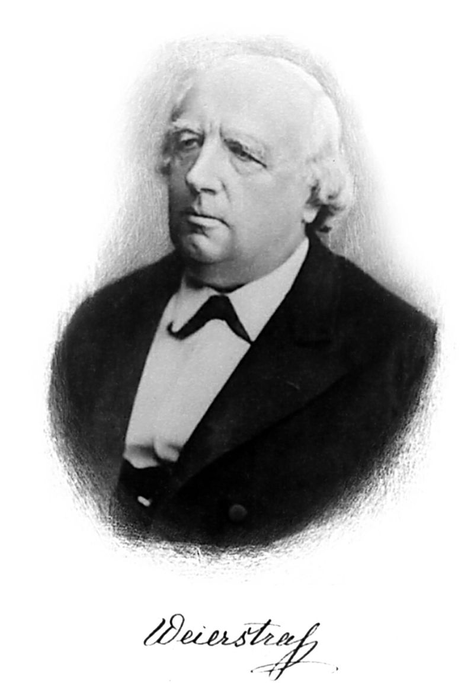

# 1600s

## 1600

- between 31.10. and 06.12.1607 - 12.01.1665 | Pierre de Fermat | 皮埃尔·德·费马 | 法国 | 数学家、律师
  
  

  (来源：[维基百科](http://www-groups.dcs.st-and.ac.uk/~history/PictDisplay/Fermat.html))

  费马是一名律师（在Parlement of Toulouse）和数学家。出生于距离法国Toulouse西北50公里远的[Beaumont-de-Lomagne](https://goo.gl/maps/yWsB9F7tXBQMv3tT6)小镇。
  
  费马的父亲Dominique Fermat是富有的皮革商人，并做过当地的执政官。费马的妈妈是Clarie de Long。

  在16世纪和17世纪初期，那时候的数学主要是将经典的希腊名人的著作，例如欧几里得Euclid、阿波罗尼Apollonius、阿基米德Archimedes、帕普斯Pappus、托勒密Ptolemy和丢番图Diophantus of Alexandria等的著作，翻译成拉丁文，修复和拓展。费马也承担过几个这样的修复项目，例如Apollonius's Planne Loci。即使是

  

  - 费马数 Fermat number

## 1650

- 06.01.1655 - 16.08.1705 | Jacob Bernoulli (also known as Jakob, James or Jacques) | 雅各布·伯努利 | 瑞士

  
  
  (来源：[维基百科](https://en.wikipedia.org/wiki/Jacob_Bernoulli))

# 1700s

## 1700

- 15.04.1707 - 18.09.1783 | Leonhard Euler | 莱昂哈德·欧拉 | 瑞士

  

  (来源：[维基百科](https://zh.wikipedia.org/wiki/%E8%90%8A%E6%98%82%E5%93%88%E5%BE%B7%C2%B7%E6%AD%90%E6%8B%89))

  欧拉是一名瑞士的数学家mathematician、物理学家physicist、天文学家astronomer、地理学家geographer、逻辑学家logician和工程师engineer。欧拉建立了图论graph theory和拓扑学topology，并且是很多其他分支的先驱，例如分析数论analytic number theory、复数分析complex analysis和微积分infinitesimal calculus。

  欧拉的爸爸保罗Paul III Euler是基督教加尔文宗（Reformed church）的一名牧师。欧拉是最大的孩子。保罗是伯努利家族Bernoulli family的朋友，热爱数学，曾参加过Jacob Bernoulli和Johann Bernoulli的授课。爸爸的经历对小欧拉有着重大影响。

## 1720

- 22.04.1724 - 12.02.104 | Immanuel Kant | 伊曼努尔·康德 | 德国

  

  (来源：维基百科 [hier](http://www.philosovieth.de/kant-bilder/bilddaten.html))

## 1740

- 23.03.1749 - 05.03.1827 | Pierre-Simon marquis de Laplace | 皮埃尔-西蒙，拉普拉斯侯爵 | 法国

  

  (Sophie Feytaud (fl.1841) - This image appears identical to the cover image used by Gillispie et al. They cite the portrait as an 1842 posthumous portrait by Madame Feytaud, courtesy of the Académie des Sciences, Paris.)

## 1770

- 30.04.1777 - 23.02.1855 | Johann Carl Friedrich Gauß | 卡尔·弗里德里希·高斯 | 德国

  

  (来源：维基百科 Lithograph showing a portrait of the German mathematician Carl Friedrich Gauss at the age of 50, Siegfried Detlev Bendixen - published in "Astronomische Nachrichten" 1828)

  高斯出生在德国的Brundswick (Braunschweig).

  高斯的第四个孩子Eugen Gauß是创建了美国第一国家银行（First National Bank），并成为其第一位主席

# 1800s

## 1810

- 31.10.1815 - 19.02.1897 | Karl Theodor Wilhelm Weierstraß |  | 德国

 

 （来源：维基百科德国版）

 Karl的爸爸Wilhelm在Karl刚出生的时候是Ostenfelde市长的秘书。1827年，他妈妈去世的时候，他的爸爸在Paderborn得到了一份固定的工作，因此Karl在那里的文理中学“Akademische Gymnasium”上学。在他爸爸的希望下，在1834年到1838年期间，Karl在波恩大学学习法律和金融。

## 1820

- 17.09.1826 - 20.07.1866 | Georg Friedrich Bernhard Riemann | 格奥尔格·弗雷德里希·伯恩哈德·黎曼 | 德国

  
  
  （来源：维基百科德国版）

  黎曼是高斯的学生。

## 1850

- 29.04.1854 - 17.07.1912 | Jules Henri Poincaré | 朱尔·亨利·庞加莱 | 法国
  
  法国最伟大的数学家之一，理论科学家和科学哲学家。19世纪后20世纪初的领袖数学家，是继高斯之后对于数学及其应用具有全面知识的最后数学家。他提出的*庞加莱猜想*是数学的最著名问题之一。

  
  
  （来源：维基百科。Popular Science Monthly Volume 82）

## 1860

- 23.01.1862 - 14.02.1943 | David Hilbert | 戴维·希尔伯特 | 德国
  
  

  (来源：维基百科。Unknown author - Possibly Reid, Constance (1970) Hilbert, Berlin, Heidelberg: Springer Berlin Heidelberg Imprint Springer, p. 230 ISBN: 978-3-662-27132-2)

  德国数学家，是19世纪末和20世纪初最具影响力的数学家之一。