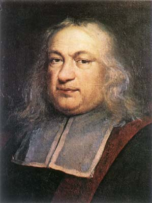
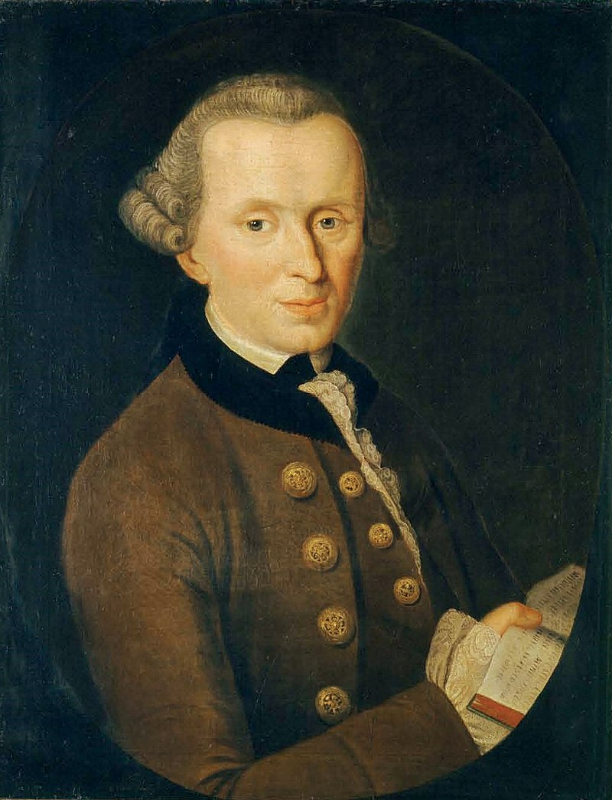
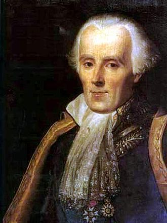
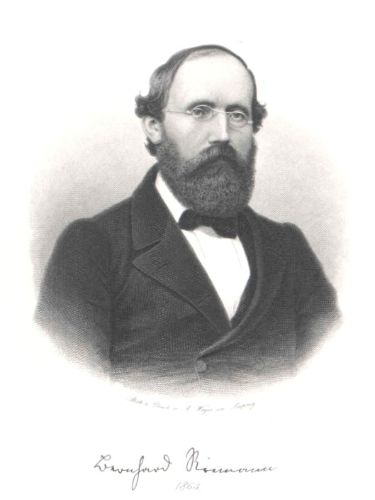
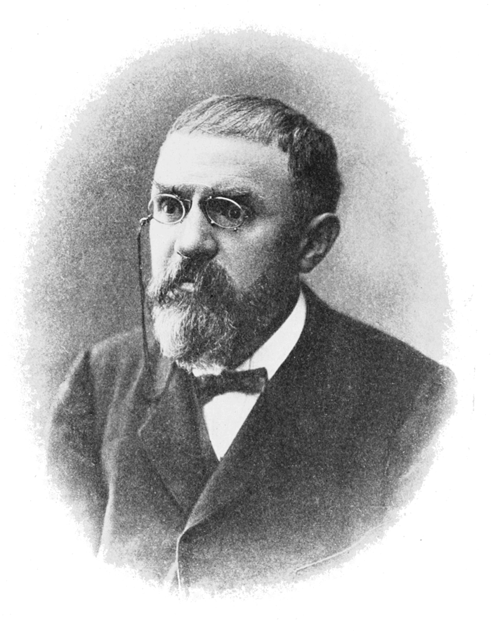

# 1600s

## 1600

- between 31.10. and 06.12.1607 - 12.01.1665 | Pierre de Fermat | 皮埃尔·德·费马 | 法国
  
  

  (来源：维基百科 [hier](http://www-groups.dcs.st-and.ac.uk/~history/PictDisplay/Fermat.html))

  费马是一名法国律师（在Parlement of Toulouse）和数学家。出生于Beaumont-de-Lomagne，父亲是富有的皮革商人。

  - 费马数 Fermat number

# 1700s

## 1720

- 22.04.1724 - 12.02.104 | Immanuel Kant | 伊曼努尔·康德 | 德国

   

   (来源：维基百科 [hier](http://www.philosovieth.de/kant-bilder/bilddaten.html))

## 1740

- 23.03.1749 - 05.03.1827 | Pierre-Simon marquis de Laplace | 皮埃尔-西蒙，拉普拉斯侯爵 | 法国

  

  (Sophie Feytaud (fl.1841) - This image appears identical to the cover image used by Gillispie et al. They cite the portrait as an 1842 posthumous portrait by Madame Feytaud, courtesy of the Académie des Sciences, Paris.)

## 1770

- 30.04.1777 - 23.02.1855 | Johann Carl Friedrich Gauß | 卡尔·弗里德里希·高斯 | 德国

  

  (来源：维基百科 Lithograph showing a portrait of the German mathematician Carl Friedrich Gauss at the age of 50, Siegfried Detlev Bendixen - published in "Astronomische Nachrichten" 1828)

  高斯出生在德国的Brundswick (Braunschweig).

  高斯的第四个孩子Eugen Gauß是创建了美国第一国家银行（First National Bank），并成为其第一位主席

# 1800s

## 1820

- 17.09.1826 - 20.07.1866 | Georg Friedrich Bernhard Riemann | 格奥尔格·弗雷德里希·伯恩哈德·黎曼 | 德国

  
  
  （来源：维基百科德国版）

  黎曼是高斯的学生。

## 1850

- 29.04.1854 - 17.07.1912 | Jules Henri Poincaré | 朱尔·亨利·庞加莱 | 法国
  
  法国最伟大的数学家之一，理论科学家和科学哲学家。19世纪后20世纪初的领袖数学家，是继高斯之后对于数学及其应用具有全面知识的最后数学家。他提出的*庞加莱猜想*是数学的最著名问题之一。

  
  
  （来源：维基百科。Popular Science Monthly Volume 82）
- 
